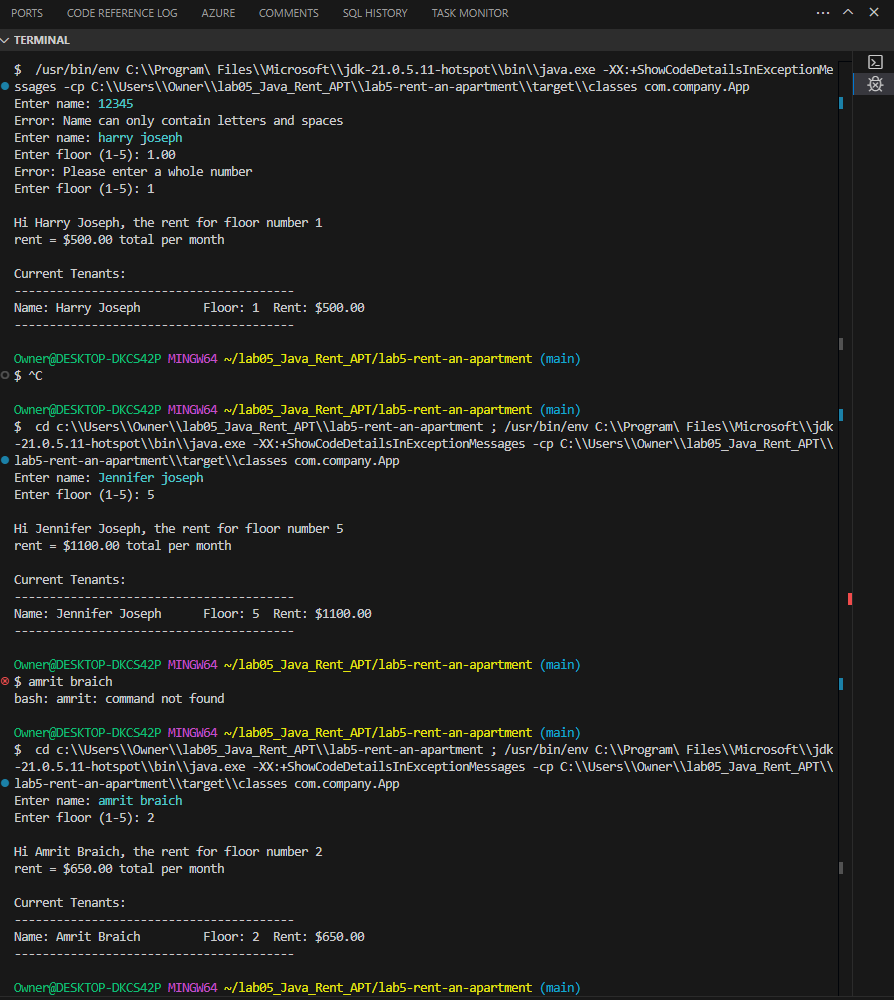

## Lab5-Rent-An-Apartment [<sup>[view code](#code-section)</sup>](#file-directory-descriptions)


## Project Synopsis
The `Lab5-Rent-An-Apartment` project is a Java-based application designed to help manage tenant information and rent schedules in an apartment building. The project includes functionality for calculating rent based on the floor number, formatting tenant names, and leveraging utility methods for string manipulation. It aims to demonstrate object-oriented programming principles such as encapsulation, aggregation, and method overriding.

### Key Features
- Manage tenant details, including name and floor number.
- Automatically format tenant names to ensure proper capitalization.
- Calculate and display rent amounts based on the floor number.
- Utility methods for string manipulation, such as capitalizing the first letter of a string.
- A test class to verify the functionality of the project.

---

## Application Output
Below is a sample screenshot showing the application in action:



The screenshot demonstrates:
- Input validation for tenant name (letters and spaces only)
- Automatic name capitalization (e.g., "john doe" → "John Doe")
- Floor number validation (must be 1-5)
- Rent calculation based on floor number:
  - Floor 1: $500/month
  - Floor 2: $650/month
  - Floor 3: $800/month
  - Floor 4: $950/month
  - Floor 5: $1100/month
- Formatted output display with tenant details
- Current tenant list with all active rentals

---

## Ideal File and Directory Structure

Below is the recommended file and directory structure for the project:

```
Lab5-Rent-An-Apartment/
├── src/
│   ├── main/
│   │   ├── java/
│   │   │   └── com/
│   │   │       └── company/
│   │   │           └── apartmentmanagement/
│   │   │               ├── Rent.java
│   │   │               ├── Tenant.java
│   │   │               ├── StringUtility.java
│   │   │               ├── ValidationUtility.java
│   │   │               └── App.java
│   │   └── resources/
│   │       └── application.properties
│   ├── test/
│       ├── java/
│       │   └── com/
│       │       └── company/
│       │           └── apartmentmanagement/
│       │               └── RentTest.java
│       │               └── TenantTest.java
│       │               └── StringUtilityTest.java
│       └── resources/
├── pom.xml
├── README.md
├── ScreenResult.png #Sample application output screen capture
└── .gitignore
```

---

## <a id="code-section"></a>File/Directory Descriptions

1. **`src/main/java/com/company/`**  
   - Contains the main source code for the project:
     - [`Rent.java`](src/main/java/com/company/Rent.java): Manages rent schedules and tenant aggregation.
     - [`Tenant.java`](src/main/java/com/company/Tenant.java): Represents a tenant with attributes like name and floor number.
     - [`StringUtility.java`](src/main/java/com/company/StringUtility.java): Provides utility methods for string manipulation.
     - [`ValidationUtility.java`](src/main/java/com/company/ValidationUtility.java): Provides utility methods for validating user inputs.
     - [`App.java`](src/main/java/com/company/App.java): The main entry point for the application.

2. **`src/test/java/com/company/`**  
   - Contains unit tests for the project:
     - [`RentTest.java`](src/test/java/com/company/RentTest.java): Tests rent calculation and tenant management.
     - [`TenantTest.java`](src/test/java/com/company/TenantTest.java): Tests tenant attributes and methods.
     - [`StringUtilityTest.java`](src/test/java/com/company/StringUtilityTest.java): Tests string manipulation utilities.


